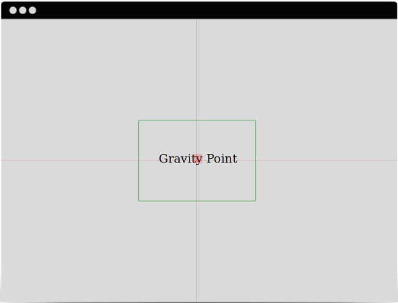

## Gravity Point

Find the centre of gravity of a webpage.

### Description

Every element of a webpage (text, image/video) can have a weight given by the area and the tone of the element.

Using [weighted aritmetic mean](http://en.wikipedia.org/wiki/Weighted_arithmetic_mean) calculations we can find the centre of gravity of every webpage.

### Why?

When watching a picture, a magazine, a website our brains are looking automagically to find equilibrum. If balance found we feel satisfaction.

A page is in *perfect equilibrum* if it's centre, and, the weighted average point of all elements on the page (gravity point) are the same.

If the gravity point is inside a golden ratio rectangle around the page centre we can say the page is in *good equilibrum*.

### Who is it for?

This aims to be a tool for web designers and developers to help them organize the elements of a webpage into harmony.

Remember, beauty is oneness and diversity in harmony.

### License

MIT License